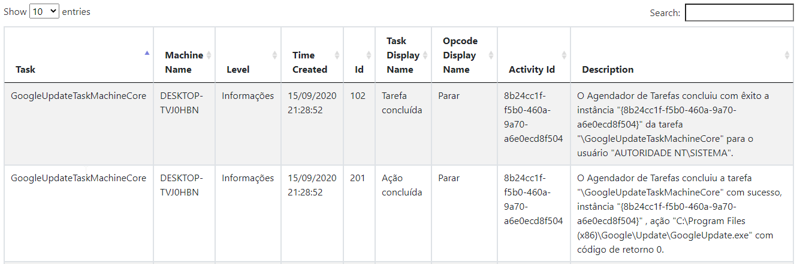

# TSHP - Task Scheduler History Plus
> Automate the query of the history of scheduled tasks.


Need to check and generate reports on the functioning of your scheduled Windows tasks? with TSHP - Task Scheduler History Plus, make this task automated, informing the names of your tasks after consultation receive a ready datatable with the requested information



## Installation

Windows:

```sh
Open TaskShedulerHistory.exe
```

## Usage example


Automate history queries for scheduled tasks and report generation with datatable.

## Development setup

Describe how to install all development dependencies and how to run an automated test-suite of some kind. Potentially do this for multiple platforms.

```sh
Open project in Visual Studio
```

## Release History

* 0.0.1
    * The first proper release
    * Work in progress

## Meta

Zanchet Luan – [@zanchetluan](https://twitter.com/zanchetluan) – luuanzanchet@outlook.com


[https://github.com/LuanZanchet/TaskSchedulerHistory](https://github.com/LuanZanchet)

## Contributing

1. Fork it (<https://github.com/LuanZanchet/TaskSchedulerHistory/fork>)
2. Create your feature branch (`git checkout -b feature/fooBar`)
3. Commit your changes (`git commit -am 'Add some fooBar'`)
4. Push to the branch (`git push origin feature/fooBar`)
5. Create a new Pull Request

<!-- Markdown link & img dfn's -->
[npm-image]: https://img.shields.io/npm/v/datadog-metrics.svg?style=flat-square
[npm-url]: https://npmjs.org/package/datadog-metrics
[npm-downloads]: https://img.shields.io/npm/dm/datadog-metrics.svg?style=flat-square
[travis-image]: https://img.shields.io/travis/dbader/node-datadog-metrics/master.svg?style=flat-square
[travis-url]: https://travis-ci.org/dbader/node-datadog-metrics
[wiki]: https://github.com/yourname/yourproject/wiki
